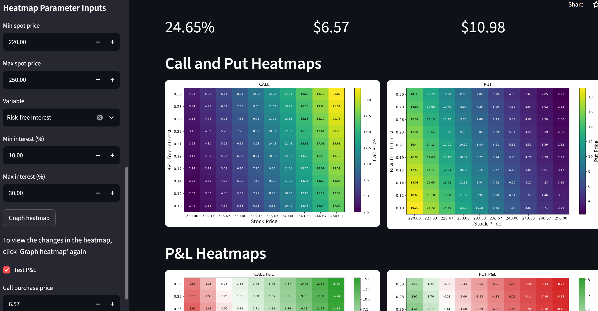
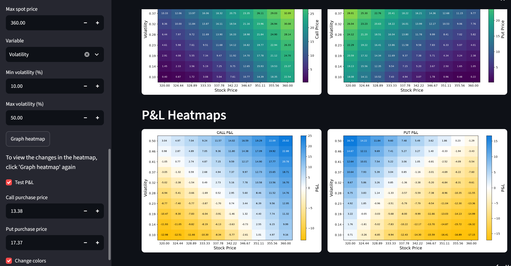

# Black-Scholes Option Pricer

Interactive Streamlit app that prices European calls and puts, estimates volatility
from market data, and visualizes option value and P&L under spot/volatility/rate scenarios.

**[Live demo](YOUR_STREAMLIT_URL)**

 

## Features
- Calculating volatility for a given stock using the most recent $N$ trading days
- Displaying a heatmap of call and put prices for differing spot prices and volatilities or interest rates
- Allowing the input of call and put purchase prices to display P&L as a heatmap with values shown in green(profit) or red(loss)
- The option to change the color gradient (for red-green color vision deficiency)

## The math

**Pricing**

For spot price $S_t$, strike $K$, risk-free rate $r$, volatility $\sigma$, and time to expiry $\tau = T - t$ (in years):

$$
d_1 = \frac{\ln(S_t/K) + \left(r + \frac{\sigma^2}{2}\right)\tau}{\sigma\sqrt{\tau}}, \qquad
d_2 = d_1 - \sigma\sqrt{\tau}
$$

$$
C = S_tN(d_1) - K e^{-r\tau} N(d_2)
$$

$$
P = K e^{-r\tau} N(-d_2) - S_tN(-d_1) = C - S_t + K e^{-r\tau}
$$

where $N(\cdot)$ is the standard normal cumulative distribution function.


**Volatility from history.** Annualized standard deviation of daily log returns
over the chosen window, $\sigma = std((\ln(P_t/P_{t-1}))\sqrt{252}$).

**P&L.** Long position, per share: model value at each shocked (spot, volatility or
rate) point minus the purchase price you enter.

## Assumptions and limitations
- European exercise (US equity options are usually American, so values are approximate, especially puts)
- No dividends; constant volatility
- Long positions only; per-share P&L
- $T$ = calendar days / 365; volatility annualized with 252 trading days
- Market data comes from yfinance, an unofficial Yahoo Finance wrapper, so it may break if Yahoo changes

## Run locally
```bash
git clone https://github.com/pamiroral/Black-Scholes-Pricer.git
cd Black-Scholes-Pricer
pip install -r requirements.txt
streamlit run app.py
```

## Project structure
- `app.py`: Streamlit interface
- `black_scholes_pricing.py`: pricing function
- `yahoo_finance_yfinance.py`: data fetching, volatility, heatmap plotting

## Possible extensions
Greeks (delta, gamma, vega, theta), implied volatility from market prices,
short positions, American options via a binomial tree.

## Disclaimer
For educational purposes only; not financial advice.

Built by [Pamir Oral](https://www.linkedin.com/in/pamir-oral-1011a220b/)


